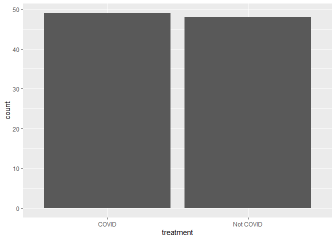
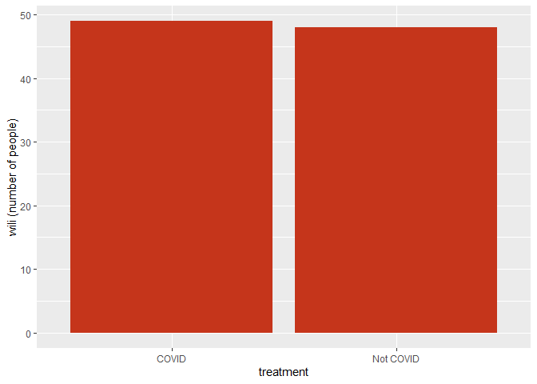
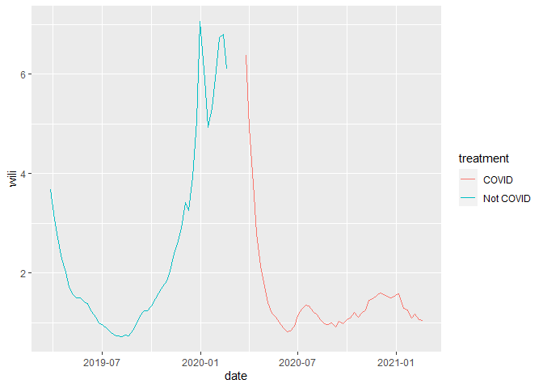
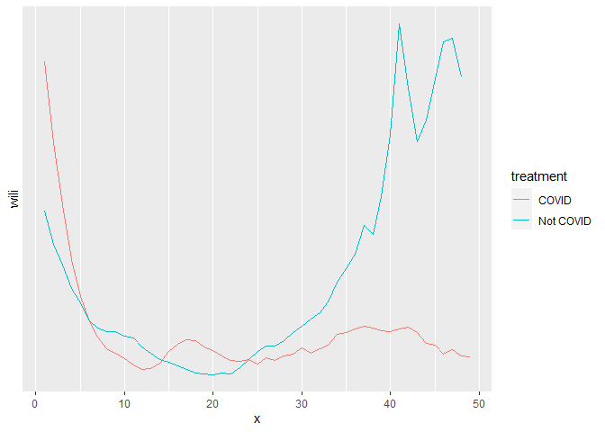

# Influenza rates for COVID-19 vs Non COVID-19 years

Connor Hayes & Chris Merkord

Biosciences Department, Minnesota State University Moorhead, 1104 7th
Avenue South, Moorhead, MN 56563 USA

## Abstract

With the overall destruction of COVID-19 and the symptoms of the upper
respiratory system, another key disease during this time of year is
influenza A and B. Both of these diseases are highly spreadable between
person-to-person contact, coughing, and touching similar objects. The
overall question is to see if there is a difference in trends of
infection of influenza between a year prior to COVID, and the current
year of COVID

We will be using data from the Center of Disease Control in order to
make these key comparisons between the two factors. With the data that
we do have, we will be doing an exploratory analysis to truly understand
if there is a diminishing trend in the number of infections of influenza
while the COVID-19 numbers went up over time.

With these expected results we can determine the plan of action not only
to be prepared for flu season next year, but to see how diseases play a
role in our society.

## Introduction

COVID has been with us not for a full year now, and we have heard all of
the updates of COVID. One thing that we have not heard about is the flu
season that we have each and every single year. WIth this very odd time
in our lives I wanted to determine what has happened to flu rates.

Did they diminish, or are they at such lows that no one caught on to
theat point. With the help of the CDC’s past data on the flu. I was able
to understand a little bit more of what actually occured. By using this
information, we can finally answer the question of what happened to the
flu this year?

This is important because by answering this question we can understand a
little bit more about what we need to do to prepare and understand the
flu before the next complete flu season occurs.

## Methods

The goal of this project was to look at the difference in wili (weekly
influenza like illness) which is a percentage that monitors outpatient
visits for influnza type illnesses. ILI is calculated by taking state
specific data and weighing it against total state population.

This data is going to be explained in a set of figures with a visual
explanation beneath in order to truly grasp concepts of influenza rates.

We determined the data that we aquired largely based on the CDC data.
This is because it is a trustworthy source for national data of specific
disease statistics, from there we had to get on the national influenza
database and we had to determine the two years that we are looking for,
2019 our non COVID year and 2020-2021 for our data. From there we get
our excel file and determine what weeks we need to do. (Centers for
Disease Control and Prevention 2020)

We had to read in our data originally from excel files and had to upload
it into R Studio, we did this by doing read csv. input in R, this was
done under the dplyr package (Wickham and Hester 2020).

Data acquisition: We had to read in our data originally from excel files
and had to upload it into R Studio, we did this by doing read csv. input
in R, this was done under the dplyr package (Wickham and Hester 2020).

Data preperation: When we get our data sets, what we see is that we have
a large number of unnessacary information within our tables, so we have
to split it up, I took off the weeks that do not correlate due to the
fact that 2019 has completed a full year of data, and 2021 has not
completed, therefore we had to have both of the weeks correlate in both
years.

Specifically we are looking at week 40 of the last cumulitave year all
the way to week seven of that current year. By using the filter function
in the dplyr package (Hadley et al. 2020) we were able to do the
necessary actions in order to take out our unnecesary weeks.

What we also did was transmute our data, doing this gave us the ability
to change the names of the original data, as well as section off the
information that we need, and delete all of the unnecessary information
that we get from our original charts. Transmute was performed by using
the dplyr package once again (Wickham et al. 2020). We also did with our
transmute function was change a couple of our variables to give a better
appeal in the table, as well as give an actual date due to the fact that
we knew the specific week and year, but we had to attatch a date as
well.

## Results

<!-- --><!-- -->

What we see with our first graph is the total percentage of WILI within
both treatment groups, COVID and Not COVID. What we see is a similar
result we see not a large difference between both treatments. With our
second figure is where we understand a little bit more about our
Infection rates.

<!-- --><!-- -->

What we see is this large difference in our influenza like illness rates
where we see this super large dip when COVID started to rise, compared
to when COVID did not occur, and we see this super large hike in
influnza rates, and we need to figure out why. There are many variables
and other things.  
\#\# Discussion

DISCUSSION

## References

-   REFERENCE 1
-   REFERENCE 2
-   REFERENCE 3
-   ETC.
